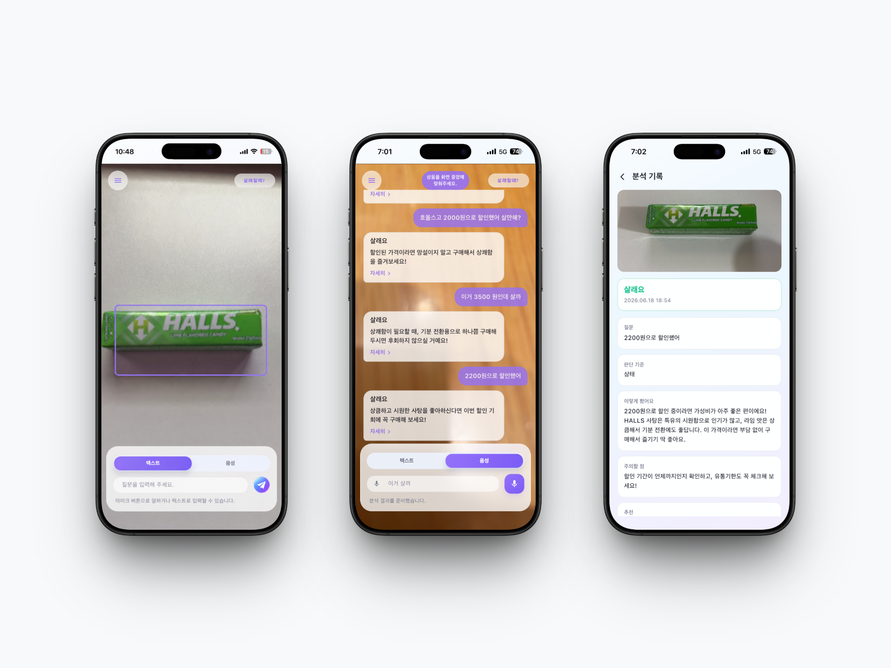

# 살래말래? (Sallae Mallae)

<p align="center">
  <b>카메라로 비추고 물어보는 AI 구매 판단 앱</b><br/>
  상품 인식부터 실시간 대화형 분석, 구매 판정 리포트까지 하나의 흐름으로 설계한 Flutter 애플리케이션
</p>

<p align="center">
  
  
  
  
  
</p>

<br/>

<p align="center">
  
</p>

---

## Overview

살래말래?는 사용자가 상품을 앞에 두고 "이거 살까?"를 바로 물어볼 수 있도록 설계한 AI 구매 판단 애플리케이션입니다.  
단순한 이미지 분류가 아니라 `상품 인식 → 대화형 분석 → 구매 판정 리포트`로 이어지는 사용자 흐름을 제품 수준으로 구현하는 데 집중했습니다.

충동구매를 부추기는 쇼핑 앱과 반대로, **사도 될지 / 사지 말아야 할 이유**까지 함께 제시하는 구매 코치를 지향합니다. AI는 결과를 **살래요 / 애매하긴해 / 말래요** 세 가지로 판정합니다.

## Problem

기존의 구매 결정 과정에는 아래 한계가 있습니다.

- 상품 앞에서 가격이 적절한지, 나에게 필요한지 즉석에서 판단하기 어려움
- 매번 검색·비교하는 정보 탐색 비용이 큼
- 쇼핑 앱은 "사게 만드는" 데 초점이라 객관적으로 말려주는 도구가 부족함

## Solution

이 문제를 해결하기 위해 아래 흐름으로 서비스를 설계했습니다.

- 카메라로 상품을 비추면 온디바이스 비전이 객체와 텍스트를 인식
- 음성 또는 텍스트로 질문, 구매 의도 키워드를 들으면 즉시 촬영·분석
- 카메라 위 채팅으로 판정과 근거를 실시간 제공하고 음성(TTS)으로 읽어줌
- 분석 결과를 대화 세션으로 저장하고 다시 불러오거나 이어서 상담

판정 근거는 `상품 정보`, `이렇게 봤어요`, `장점`, `단점`, `주의할 점`, `추천`으로 구조화해 제공합니다.

## Platform Support

| Platform | Support |
| --- | --- |
| Android | 카메라 스트림과 ML Kit 비전, 채팅 UX 중심 지원 |
| iOS | 카메라 권한·ATS 대응, 한글 입력과 레이아웃 안정성 고려 (iOS 15.5+) |

## Core Features

- 카메라 실시간 객체 감지 및 텍스트 인식(OCR)
- 음성/텍스트 질문, 구매 의도 키워드 인식 시 즉시 캡쳐
- AI와의 대화형 찬반 분석 채팅
- 세션 로딩, 분석 중, 실패/재시도 상태를 포함한 안정적인 상호작용
- 판정·요약·장점·단점·주의·추천을 포함한 결과 리포트
- 대화 세션 저장·불러오기·스와이프 삭제, "새로운 고민"으로 새 세션
- 직전 사진 재활용으로 빠른 후속 질문
- Pro Mode, 로그인/회원가입, 보안 토큰 저장

## UI/UX

| Feature | Description |
| --- | --- |
| Camera Capture | 상품을 비추면 대표 프레임을 골라 분석에 사용, 구매 의도 키워드는 즉시 촬영 |
| Conversational Analysis | 카메라 위 채팅 UI에서 AI와 실시간으로 판단을 주고받는 구조 |
| Verdict Detail | 상품 정보·장점·단점·주의·추천과 분석 사진을 상세 리포트로 제공 |
| Chat Sessions | 서랍에서 지난 상담을 불러오고 스와이프로 삭제 |

## Tech Stack

| Layer | Stack |
| --- | --- |
| Frontend | `Flutter`, `flutter_riverpod`, `go_router` |
| Networking | `Dio` |
| On-device Vision | `google_mlkit_object_detection`, `google_mlkit_text_recognition` |
| Voice | `speech_to_text`, `flutter_tts` |
| Storage | `shared_preferences`, `flutter_secure_storage` |
| Architecture | `Data - Domain - Application - Presentation` |
| Backend | `FastAPI`, `Florence-2`, `RAG`, `Gemini` |
| Target Platforms | `Android`, `iOS` |

```text
lib/
├── app/                # 라우팅 · 테마 · 에셋
├── core/               # network · image · errors
└── features/
    └── <feature>/
        ├── data/         # datasource · model · repository
        ├── domain/       # entity · usecase · repository 인터페이스
        ├── application/  # 상태/프로바이더
        └── presentation/ # 화면 · 위젯
```

> 주요 feature: `camera`, `vision`, `analysis`, `chat`, `history`, `auth`, `settings`, `speech_input`, `voice_output`, `permission`

## Analysis Pipeline

이미지에서 **사실을 고정(grounding)** 한 뒤 그 위에서 **판단(reasoning)** 하는 2단계 구조입니다.

```text
[ 카메라 프레임 ]
   │  ML Kit 객체 감지 · OCR · 프레임 품질 평가 (온디바이스 사전 필터)
   ▼
POST /api/v1/chat/analyze          (분석 + 대화 저장 통합)
   │  1) 세션 확보 (없으면 생성 / 이미지 없으면 마지막 사진 재활용)
   │  2) Florence-2  — 비전 그라운딩 (캡션·객체·OCR → 구조화된 시각 사실)
   │  3) RAG         — 가격·제품 상식 보강
   │  4) Gemini      — 시각 사실 + 질문 + 맥락 → 최종 판정·근거
   │  5) 대화 저장 (user/assistant 메시지)
   ▼
{ verdict, verdict_label, product_info, reason, pros, cons,
  caution, recommendation, image_reused, messages[] }
```

## Technical Highlights

| Area | Decision | Impact |
| --- | --- | --- |
| State Management | 카메라·분석·채팅·히스토리마다 Riverpod 프로바이더 분리 | 로딩, 입력, 성공, 실패 상태가 서로 섞이지 않도록 제어 |
| Two-stage Analysis | Florence-2로 시각 사실을 고정하고 Gemini가 판단을 담당 | LLM 환각을 줄이고 OCR·가격 인식 신뢰도와 비용 효율 확보 |
| Session Flow | 분석마다 `session_id`를 추적하고 이미지 없으면 서버가 마지막 사진 재활용 | 후속 질문의 문맥 유지와 업로드 비용 절감 |
| On-device Pre-filter | ML Kit 검출·품질 평가로 대표 프레임 선택, ~1fps 샘플링 | 불량 요청 사전 차단과 발열·서버 비용 절감 |
| Network Handling | `DioException` 유형·상태 코드 기준 오류 세분화, 401 자동 로그아웃 | 타임아웃, 인증 만료, 4xx/5xx, 연결 실패를 구분해 안내 |
| Secure Auth | 토큰을 `flutter_secure_storage`에 저장하고 세션 만료 시 재로그인 유도 | 인증 상태의 안전한 보관과 복구 |

## Troubleshooting

| Issue | Approach | Result |
| --- | --- | --- |
| 음성 부분 인식 반복으로 분석이 중복 실행 | 제출 가드와 리스닝 세션당 1회 트리거 적용 | 키워드 인식 즉시 단일 캡쳐로 분석 |
| 캡쳐 후 검출 박스가 멈춰 앱 재시작 필요 | 캡쳐 시 검출 상태 해제 + 처리 가드 리셋 + 타임아웃·세대 가드 | 분석 후 박스 해제와 끊김 없는 재검출 |
| 서버 히스토리 진입 시 초기화 크래시 | 프로바이더 첫 로드를 다음 프레임으로 지연 | uninitialized-provider 크래시 제거 |
| 불러온 대화에 판정·사진이 빠지는 문제 | 메시지 `data`로 판정 복원, `image_base64` 디코드로 사진 표시 | 과거 세션도 판정·사진까지 완전 복원 |

## Testing

핵심 흐름의 회귀를 막기 위한 위젯/상태 테스트를 점진적으로 확대하고 있습니다.

```bash
flutter test
```

## Roadmap

- 검출 실패 시 이전 사진 재활용 정책 고도화
- 대화 세션 기반 분석 통계 리포트
- 주제/상품 카테고리 추천 개인화
- 프로바이더·화면 단위 테스트 범위 확대
- TestFlight 외부 테스트 및 배포 자동화

## Running Locally

```bash
flutter pub get

# 백엔드 주소 설정 (.env, 커밋하지 않음)
echo "API_BASE_URL=http://<your-backend-host>" > .env

flutter run
```
